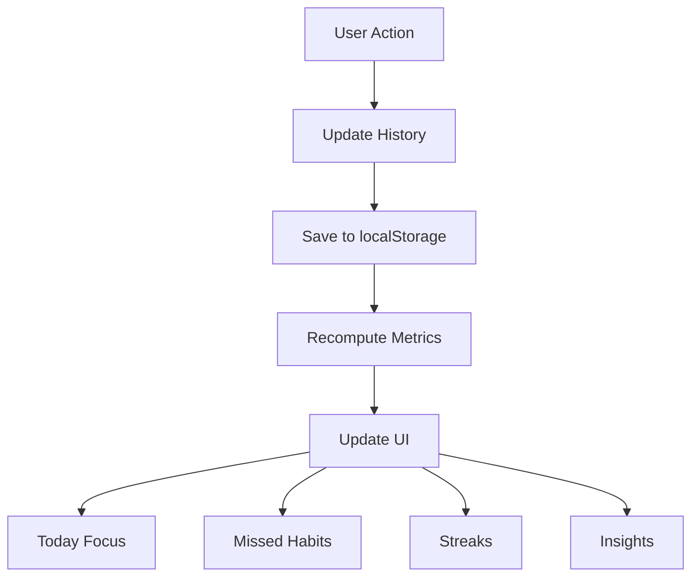

# 🚀 HabitPulse — Local-First Habit Execution System

> **Not a habit tracker. A system to actually follow through.**

HabitPulse is a **local-first, behavior-driven habit execution system** built as a Progressive Web App (PWA).

It is designed to eliminate friction, reduce overwhelm, and help users **take action daily** — not just track it.

---


---

## 💡 Why HabitPulse Exists

Most habit apps fail because they:

- overwhelm users with too many features
- punish missed habits
- focus on tracking instead of execution

HabitPulse flips this:

> **From tracking habits → to executing them**

---

## 🧠 Core Philosophy

HabitPulse is built on four principles:

### ⚡ **Action over Tracking**

> Users don’t need more data.
> They need to know what to do _right now_.

---

### 🧭 **Guidance over Overload**

> Show less. Guide better.
> Remove noise, highlight action.

---

### 🔁 **Recovery over Guilt**

> Missing a habit shouldn’t break your system.
> It should be recoverable instantly.

---

### 🔐 **Privacy by Default**

> No backend. No tracking. No analytics.
> Your data stays on your device.

---

## 🔥 Key Features

---

### 🎯 **Today Focus System**

- Shows only **top 3 actionable habits**
- Sorted by time
- Updates dynamically

👉 Eliminates decision fatigue
👉 Drives immediate action

---

### 🔄 **Missed Habits Recovery**

- Detects overdue habits
- Allows:
  - ✅ Complete Now
  - ⏳ Snooze (+30m / +1h)

👉 No guilt
👉 No broken streak mentality

---

### 🔥 **Intelligent Streak Engine**

- Skips current day if incomplete
- Tracks real consistency
- Prevents premature streak breaks

👉 Built for real human behavior

---

### 📊 **Behavior-Driven Insight Engine**

- Detects patterns:
  - morning vs evening consistency
  - high-friction habits
  - overload detection

- Provides:
  - non-repetitive insights
  - actionable suggestions

---

### 🔔 **Robust Notification System**

- 30-second background heartbeat
- 60-second execution window
- Missed recovery detection
- Duplicate prevention

👉 Works within real browser limits

---

### 💾 **Local-First Architecture**

- No backend
- No accounts
- No data tracking

---

### 📦 **Backup & Portability**

- Export / Import JSON
- Full data control

---

### 📱 **Installable PWA**

- Add to Home Screen
- Works offline
- App-like experience

---

## 🏗️ Architecture

HabitPulse is built on a **history-first model**.

Instead of storing state like:

```ts
completed: true;
```

It stores:

```ts
history: [{ date: "YYYY-MM-DD", completed: true }];
```

---

### ✅ Why This Matters

All features are derived from history:

- streaks
- insights
- progress
- weekly stats

👉 No state mismatch
👉 No data inconsistency

---

## 🔄 Data Flow



---

## 🔁 Core Behavior Loop

```text
Open App
   ↓
See Today Focus
   ↓
Take Action
   ↓
Get Feedback (Streak / Progress)
   ↓
Recover Missed Habits
   ↓
Repeat Daily
```

---

## 🚀 User Flow

1. **Add Habit**
2. **See Today Focus**
3. **Complete Habits**
4. **Recover Missed Ones**
5. **Build Streak & Insights**

---

## 📱 Install (PWA)

### iPhone (Safari)

1. Open site
2. Tap Share
3. Add to Home Screen

---

### Android (Chrome)

1. Open site
2. Tap menu
3. Install App

---

## 🔐 Privacy & Security

- All data stored locally
- No external API calls
- No analytics tracking
- Safe storage handling
- Validated imports

---

## ⚙️ Tech Stack

- **Next.js (App Router)**
- **TypeScript**
- **Tailwind CSS**
- **Framer Motion**
- **Service Worker (PWA)**
- **LocalStorage API**

---

## 🧪 Future Scope

- Secure multi-device sync
- Optional cloud backup
- Minimal advanced analytics

---

## 💣 Final Positioning

HabitPulse is not:

❌ A habit tracker
❌ A productivity dashboard

It is:

> ✅ **A habit execution system designed for real human behavior**

---

## 👨‍💻 Built By

Built with focus on:

- simplicity
- behavior design
- real-world usability

---

> **“Consistency is not built by tracking. It is built by doing.”**
